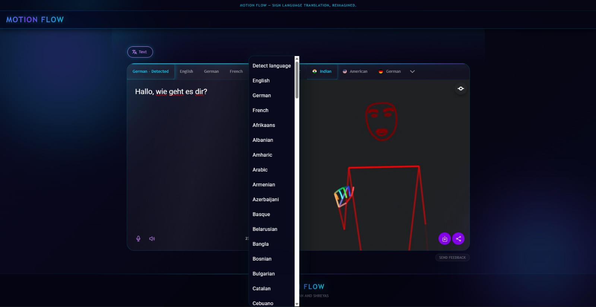
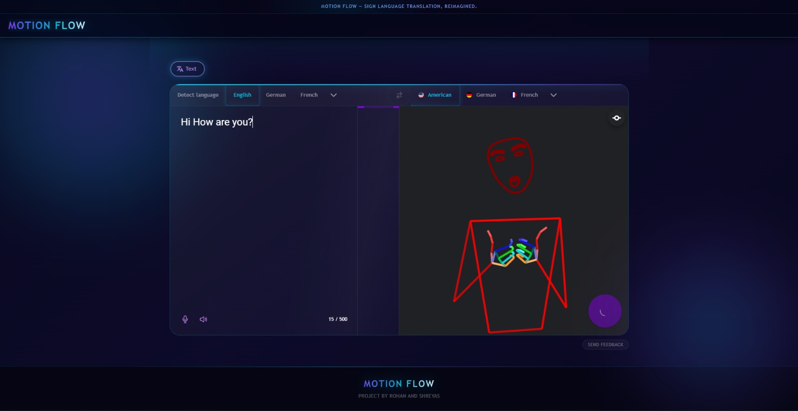

<div align="center">

<h1>
  &nbsp;Motion Flow - An Advance Sign Language Translation Pipeline 
</h1>

<p align="center">
  <strong>Real-time, bidirectional sign language translation — powered entirely in the browser.</strong><br/>
  Bridging the communication gap between Deaf and hearing communities through AI, computer vision, and modern web technology.
</p>

<br/>

[](https://github.com/sherurox/Motion-Flow)
[](LICENSE.md)
[](https://angular.dev)
[](https://www.tensorflow.org/js)
[](https://nodejs.org)
[](https://firebase.google.com)
[](https://web.dev/progressive-web-apps/)
[](https://github.com/sherurox/Motion-Flow)

<br/>

[**Live Demo**](https://github.com/sherurox/Motion-Flow) · [**Documentation**](docs/) · [**Report a Bug**](https://github.com/sherurox/Motion-Flow/issues) · [**Request a Feature**](https://github.com/sherurox/Motion-Flow/issues)

</div>

---

## 📸 Interface Showcase

<div align="center">

| Spoken → Signed Translation | Signed → Spoken Recognition |
|:---:|:---:|
|  |  |
| *Real-time text and speech input is processed through the BrowserMT neural pipeline and rendered as a fluid 3D avatar animation or skeleton overlay — entirely client-side.* | *Continuous signing captured via webcam is decomposed into body, hand, and facial landmarks by MediaPipe Holistic and decoded into natural spoken language text with audio synthesis.* |

</div>

---

## 🧭 Table of Contents

- [Overview](#-overview)
- [Key Features](#-key-features)
- [System Architecture](#-system-architecture)
- [Tech Stack](#-tech-stack)
- [Project Structure](#-project-structure)
- [Installation & Setup](#-installation--setup)
- [Usage](#-usage)
- [Configuration](#-configuration)
- [Contributors](#-contributors)
- [License](#-license)

---

## 🔭 Overview

**Motion-Flow** is a production-grade, open-source web application that performs **real-time, bidirectional translation between spoken and signed languages**. Unlike legacy solutions requiring dedicated hardware or native applications, Motion-Flow operates entirely within the browser using WebAssembly, WebGL, and WebGPU-accelerated neural networks — making it universally accessible with zero installation overhead.

The platform supports **40+ signed languages** (ASL, BSL, GSL, LSF, ISL, and more) and an equivalent range of spoken languages, with a privacy-first architecture that performs all inference locally on-device wherever possible. Cloud fallback is available for computationally intensive operations, with full user consent controls.

> **Mission:** Eliminate the communication barrier between Deaf and hearing communities by providing a free, accurate, and real-time translation tool accessible to anyone with a modern web browser.

---

## ✨ Key Features

- **🔁 Bidirectional Translation** — Seamlessly switch between Spoken → Signed and Signed → Spoken modes with a single interaction; state is preserved and transitions are instantaneous.

- **🧠 In-Browser Neural Inference** — All ML models (TensorFlow.js, MediaPipe Holistic) execute directly in the browser via WebGL/WebGPU backends — no data leaves the device.

- **🖐️ Full-Body Pose Estimation** — MediaPipe Holistic captures 543 landmarks per frame: 33 body, 21 per hand, and 468 facial keypoints, enabling high-fidelity sign reconstruction.

- **🎭 Multi-Modal Rendering** — Output signing is rendered as a rigged 3D avatar (Three.js), a skeletal pose overlay, or a composited video — switchable in real time.

- **🌐 40+ Language Pairs** — Comprehensive coverage of international signed and spoken languages with automatic language detection powered by MediaPipe and CLD3.

- **📝 SignWriting Integration** — Intermediate representation uses Formal SignWriting (FSW) notation, enabling structured storage, search, and rendering of sign sequences.

- **🔊 Speech-to-Text & Text-to-Speech** — Native Web Speech API integration for audio input/output with fallback text entry; no third-party API keys required for basic operation.

- **📱 Cross-Platform PWA** — Installable as a Progressive Web App with offline caching via Angular Service Worker; native mobile builds available via Capacitor 8.

- **⚡ Modular, Scalable Architecture** — Feature-based Angular modules with NGXS reactive state management ensure clean separation of concerns and straightforward extensibility.

- **🔒 Privacy-First by Design** — Camera and microphone streams are processed entirely in-browser; no biometric data is transmitted to remote servers without explicit user action.

- **🚀 Web Worker Offloading** — BrowserMT translation runs in a dedicated Web Worker thread, keeping the main thread unblocked and the UI fluid at all times.

- **📊 Performance Benchmarking** — Built-in benchmark suite (`/benchmark`) for measuring inference throughput, translation latency, and pose estimation frame rate across hardware configurations.

---

## 🏗️ System Architecture

Motion-Flow is structured as a layered, event-driven architecture where all data flows through a centralized NGXS state store, decoupling UI components from business logic and ML inference pipelines.

### High-Level Data Flow

```
┌────────────────────────────────────────────────────────────────────┐
│                        USER INTERFACE LAYER                        │
│         Angular 21 Standalone Components  ·  Ionic 8 UI Kit       │
└──────────────────────────────┬─────────────────────────────────────┘
                               │  Dispatch Actions
                               ▼
┌────────────────────────────────────────────────────────────────────┐
│                     NGXS STATE MANAGEMENT LAYER                    │
│                                                                    │
│  ┌─────────────┐  ┌──────────────┐  ┌────────────┐  ┌──────────┐  │
│  │  Translate  │  │   Settings   │  │    Pose    │  │Detector  │  │
│  │    State    │  │    State     │  │   State    │  │  State   │  │
│  └──────┬──────┘  └──────────────┘  └─────┬──────┘  └────┬─────┘  │
│         │                                 │               │        │
└─────────┼─────────────────────────────────┼───────────────┼────────┘
          │ Select / Effect                 │               │
          ▼                                 ▼               ▼
┌────────────────────────────────────────────────────────────────────┐
│                       SERVICE / BUSINESS LOGIC LAYER               │
│                                                                    │
│  ┌──────────────────┐  ┌──────────────────┐  ┌─────────────────┐  │
│  │ Translation Svc  │  │   Pose Service   │  │ Detector Svc    │  │
│  │ (BrowserMT model │  │ (MediaPipe wrap) │  │ (TF.js model)   │  │
│  │  + segmentation) │  │                  │  │                 │  │
│  └────────┬─────────┘  └────────┬─────────┘  └────────┬────────┘  │
│           │                     │                      │           │
│  ┌────────┴─────────┐  ┌────────┴─────────┐  ┌────────┴────────┐  │
│  │ SignWriting Svc   │  │  Animation Svc   │  │ Language Detect │  │
│  │ (FSW rendering)  │  │ (3D pose → anim) │  │ (MediaPipe/CLD3)│  │
│  └──────────────────┘  └──────────────────┘  └─────────────────┘  │
└──────────────────────────────┬─────────────────────────────────────┘
                               │
          ┌────────────────────┼───────────────────────┐
          ▼                    ▼                        ▼
┌──────────────────┐  ┌──────────────────┐  ┌──────────────────────┐
│  TensorFlow.js   │  │ MediaPipe        │  │   Three.js           │
│  (WebGL/WebGPU)  │  │ Holistic         │  │   3D Avatar Renderer │
│  Sign Detector   │  │ 543-pt Landmarks │  │   Pose Overlay       │
└──────────────────┘  └──────────────────┘  └──────────────────────┘
                               │
                               ▼
┌────────────────────────────────────────────────────────────────────┐
│                    FIREBASE CLOUD FUNCTIONS (Backend)              │
│                                                                    │
│  ┌──────────────┐  ┌──────────────┐  ┌─────────────────────────┐  │
│  │   Gateway    │  │ Text-to-Text │  │   Text Normalization    │  │
│  │ (Express v5) │  │ (BrowserMT   │  │   (OpenAI + caching)    │  │
│  │ Rate-limited │  │  + caching)  │  │                         │  │
│  │ via Unkey    │  │              │  │                         │  │
│  └──────────────┘  └──────────────┘  └─────────────────────────┘  │
│                                                                    │
│       Firebase Realtime DB (MD5 cache)  ·  Cloud Storage (models) │
└────────────────────────────────────────────────────────────────────┘
```

### Translation Pipelines

**Spoken → Signed**
```
Audio / Text Input
  │
  ├─ [Web Speech API]          Converts microphone input to raw text
  │
  ├─ [Language Detection]      MediaPipe / CLD3 identifies source language
  │
  ├─ [Text Normalization]      Optional OpenAI-powered cleanup (Cloud Function)
  │
  ├─ [Sentence Segmentation]   Splits input into translation units
  │
  ├─ [BrowserMT Translation]   Text → Formal SignWriting (FSW) via Web Worker
  │
  ├─ [Pose Generation]         FSW sequences → 3D landmark trajectories
  │
  └─ [Rendering]               Three.js avatar  |  Skeleton overlay  |  Video
```

**Signed → Spoken**
```
Webcam / Video Upload
  │
  ├─ [MediaPipe Holistic]      Per-frame extraction of 543 body landmarks
  │
  ├─ [Sign Detector]           TF.js model — determines active signing segments
  │
  ├─ [SignWriting Service]      Landmark geometry → FSW notation
  │
  ├─ [BrowserMT Translation]   FSW → spoken language text (Web Worker)
  │
  └─ [Text-to-Speech]          Web Audio API synthesises output audio
```

### Design Patterns

| Pattern | Implementation |
|---|---|
| **State Machine** | NGXS store with typed actions and immutable reducers |
| **Strategy Pattern** | `LanguageDetectionService` abstraction — swappable MediaPipe / CLD3 backends |
| **Observer Pattern** | RxJS observables with `takeUntil` for lifecycle-safe subscriptions |
| **Singleton Loader** | Static `loadPromise` on `PoseService` prevents duplicate model instantiation |
| **Lazy Loading** | Angular route-level code splitting minimises initial bundle payload |
| **Worker Offloading** | BrowserMT inference runs in a dedicated Web Worker, preserving UI thread budget |
| **MD5 Cache** | Firebase Realtime DB keyed by input hash — eliminates redundant cloud inference |

---

## 🛠️ Tech Stack

### Frontend

| Category | Technology | Version |
|---|---|---|
| Framework | Angular | 21.0.6 |
| Language | TypeScript | 5.9.3 |
| State Management | NGXS | 21.0.0 |
| UI Component Library | Ionic Angular | 8.7.14 |
| Design System | Angular Material | 21.0.5 |
| Reactive Programming | RxJS | 7.x |
| Internationalisation | Transloco | 8.2.0 |
| PWA | Angular Service Worker | 21.0.x |
| Mobile Runtime | Capacitor | 8.0.0 |

### AI / ML / Computer Vision

| Category | Technology | Version |
|---|---|---|
| Neural Network Runtime | TensorFlow.js | 4.22.0 |
| GPU Acceleration | TF.js WebGL / WebGPU backends | 4.22.0 |
| Pose Estimation | MediaPipe Holistic | Latest |
| Language Detection | MediaPipe Language Detector + CLD3 | Latest |
| Sign Translation | BrowserMT (Bergamot) | 0.2.3 |
| 3D Avatar Rendering | Three.js | 0.182.0 |
| Pose Formatting | pose-format + pose-viewer | 1.2.0 |
| SignWriting | Sutton SignWriting Components | 1.1.0 |

### Backend & Infrastructure

| Category | Technology | Version |
|---|---|---|
| Cloud Functions Runtime | Firebase Functions v2 | 7.0.2 |
| HTTP Server | Express.js | 5.2.1 |
| Admin SDK | Firebase Admin | 13.6.0 |
| Storage | Google Cloud Storage | 7.18.0 |
| Rate Limiting / Auth | Unkey API | 2.2.1 |
| Text Normalisation | OpenAI API | 6.15.0 |
| Schema Validation | Zod | 4.2.1 |
| Security | Firebase App Check | — |

### Developer Experience

| Category | Technology |
|---|---|
| Build Toolchain | Angular CLI 21, Vite |
| Linting | ESLint 9.39.2 |
| Formatting | Prettier 3.7.4 |
| Git Hooks | Husky 9.1.7 + lint-staged |
| Testing (Frontend) | Jasmine 5, Karma, Chrome Headless |
| Testing (Backend) | Jest |
| Deployment | Firebase Tools 15.x |

---

## 📁 Project Structure

```
Motion-Flow/
│
├── src/                              # Angular application source
│   ├── app/
│   │   ├── app.component.ts          # Root shell — cookie consent, i18n bootstrap
│   │   ├── app.config.ts             # Angular providers, NGXS store registration
│   │   ├── app.routes.ts             # Lazy-loaded top-level route definitions
│   │   │
│   │   ├── components/               # Shared, reusable UI components
│   │   │   ├── animation/            # Three.js avatar animation viewer
│   │   │   ├── speech-to-text/       # Web Speech API wrapper
│   │   │   ├── text-to-speech/       # Web Audio API TTS component
│   │   │   ├── video/                # MediaStream video player
│   │   │   ├── map/                  # Geographic language selector
│   │   │   └── i18n-language-selector/
│   │   │
│   │   ├── modules/                  # Feature modules with co-located state
│   │   │   ├── translate/            # Core translation pipeline
│   │   │   │   ├── translate.state.ts        # NGXS state (primary orchestrator)
│   │   │   │   ├── translate.actions.ts      # Typed action definitions
│   │   │   │   ├── translate.service.ts      # Language lists, segmentation, URLs
│   │   │   │   └── language-detection/       # MediaPipe & CLD3 strategies
│   │   │   ├── pose/                 # MediaPipe Holistic integration
│   │   │   ├── detector/             # TF.js sign activity detection
│   │   │   ├── animation/            # Pose-to-animation conversion
│   │   │   ├── sign-writing/         # FSW parsing and canvas rendering
│   │   │   └── settings/             # User preference state
│   │   │
│   │   ├── pages/                    # Route-level page components
│   │   │   ├── translate/            # Main translation interface
│   │   │   │   ├── translate-desktop/        # Responsive desktop layout
│   │   │   │   ├── translate-mobile/         # Responsive mobile layout
│   │   │   │   └── pose-viewers/             # Avatar / skeleton / person modes
│   │   │   ├── settings/             # Appearance, behaviour preferences
│   │   │   ├── benchmark/            # Performance measurement suite
│   │   │   ├── playground/           # Experimental feature sandbox
│   │   │   └── landing/              # About, contribute, legal pages
│   │   │
│   │   ├── core/                     # Cross-cutting infrastructure
│   │   │   ├── services/
│   │   │   │   ├── holistic.service.ts       # MediaPipe Holistic bootstrap
│   │   │   │   ├── tfjs/                     # TensorFlow.js initialisation
│   │   │   │   ├── navigator/                # Camera / microphone access
│   │   │   │   └── http/                     # Firebase auth token interceptor
│   │   │   ├── helpers/                      # Pure utility functions
│   │   │   └── modules/
│   │   │       └── google-analytics/         # GA4 event tracking
│   │   │
│   │   └── directives/               # Custom Angular structural directives
│   │
│   ├── assets/                       # Static assets served at runtime
│   │   ├── icons/                    # PWA icons, Apple splash screens
│   │   ├── appearance/               # Background / theme images
│   │   └── models/                   # Bundled lite ML model artefacts
│   │
│   └── environments/                 # Build-time environment configurations
│
├── functions/                        # Firebase Cloud Functions (Node.js 20)
│   └── src/
│       ├── index.ts                  # Function exports entry point
│       ├── gateway/                  # Public API router (Express, CORS, rate-limit)
│       ├── text-to-text/             # BrowserMT model management + translation cache
│       │   └── model/                # Model download and chunked storage logic
│       ├── text-normalization/       # OpenAI-backed text normalisation endpoint
│       ├── prerender/                # SEO prerendering + OpenSearch XML
│       ├── middlewares/              # Unkey auth, App Check, CORS, error handling
│       └── utils/                    # Shared Cloud Function utilities
│
├── docs/                             # VitePress documentation site
│   └── .vitepress/
│
├── tools/                            # Build and code-generation scripts
│
├── angular.json                      # Angular CLI workspace configuration
├── capacitor.config.ts               # Capacitor mobile build configuration
├── firebase.json                     # Firebase Hosting + Functions deployment
├── ngsw-config.json                  # Service Worker caching strategy
├── tsconfig.json                     # Root TypeScript configuration
├── .eslintrc.json                    # Lint rules
├── .prettierrc.json                  # Code style rules
├── 1.jpeg                            # Interface screenshot — Spoken to Signed
├── 2.jpeg                            # Interface screenshot — Signed to Spoken
└── package.json
```

---

## ⚙️ Installation & Setup

### Prerequisites

| Requirement | Minimum Version |
|---|---|
| Node.js | `>= 18.0.0` |
| npm | `>= 9.0.0` |
| Modern Browser | Chrome 112+ / Firefox 115+ / Safari 16.4+ |
| Webcam | Required for signed → spoken mode |
| GPU (optional) | WebGL/WebGPU-capable GPU significantly improves inference throughput |

### 1. Clone the Repository

```bash
git clone https://github.com/sherurox/Motion-Flow.git
cd Motion-Flow
```

### 2. Install Dependencies

```bash
npm install
```

### 3. Configure Environment Variables

```bash
cp env.ts.example env.ts
```

Edit `env.ts` with your credentials:

```typescript
// env.ts
export const environment = {
  production: false,

  // Firebase project configuration
  firebase: {
    apiKey: "YOUR_FIREBASE_API_KEY",
    authDomain: "YOUR_PROJECT.firebaseapp.com",
    projectId: "YOUR_PROJECT_ID",
    storageBucket: "YOUR_PROJECT.appspot.com",
    messagingSenderId: "YOUR_SENDER_ID",
    appId: "YOUR_APP_ID",
    measurementId: "YOUR_MEASUREMENT_ID",
    databaseURL: "https://YOUR_PROJECT-default-rtdb.firebaseio.com",
  },

  // Google Analytics (optional)
  googleAnalyticsId: "G-XXXXXXXXXX",

  // API base URL (point to local emulator for development)
  apiUrl: "http://localhost:5001/YOUR_PROJECT/us-central1",
};
```

### 4. (Optional) Start Firebase Emulators

For full local backend development without deploying to Firebase:

```bash
npm install -g firebase-tools

# Start all emulators — Functions, Realtime DB, Storage, Hosting
firebase emulators:start
```

### 5. Install Cloud Functions Dependencies

```bash
cd functions
npm install
cd ..
```

---

## 🚀 Usage

### Development Server

```bash
npm start
```

Navigate to `http://localhost:4200`. The application supports hot-module replacement — changes to source files are reflected immediately without a full page reload.

### Production Build

```bash
# Full production build — includes sitemap, licenses, and documentation generation
npm run build:full

# Standard production build only
npm run build
```

Output artefacts are written to `dist/sign-translate/browser/`.

### Deploy to Firebase

```bash
npm run deploy
```

Executes the full build pipeline and atomically deploys the Angular application (Firebase Hosting) and Cloud Functions.

### Mobile Build (Capacitor)

```bash
# Sync web build to native mobile project
npm run mobile:sync

# Generate mobile app store metadata and assets
npm run mobile:metadata
```

### Run Tests

```bash
# Unit tests — Karma + Jasmine, Chrome headless
npm test

# CI-optimised test run (no watch mode)
npm run test:ci

# Cloud Functions tests — Jest
cd functions && npm test
```

### Run Benchmark Suite

```bash
npm start
# Navigate to http://localhost:4200/benchmark
```

The benchmark suite measures sign detection inference latency, translation throughput (tokens/second), and pose estimation frame rate across all available hardware backends (CPU, WebGL, WebGPU).

### Bundle Size Analysis

```bash
npm run analyze
```

Launches Webpack Bundle Analyzer to identify optimisation opportunities across the production build.

---

## 🔧 Configuration

### Pose Viewer Mode

Three rendering modes are available from **Settings → Appearance**:

| Mode | Description |
|---|---|
| `avatar` | Rigged 3D human avatar rendered via Three.js |
| `pose` | Skeletal landmark overlay drawn on canvas |
| `person` | Live camera feed composited with landmark overlay |

### Supported Signed Languages (Sample)

```
ASL  · BSL  · GSL  · FSL  · LSF  · ISL  · JSL  · LSP  · LIS
Libras · AUSLAN · NZSL · SSL · VSL · CSL · HKSL · KSL · MSL
+ 25 additional signed language variants
```

### Service Worker Caching

Caching behaviour is defined in `ngsw-config.json`. ML model files use a `freshness` strategy with long-lived cache entries to minimise redundant downloads across sessions.

---

## 👥 Contributors

<table>
  <tr>
    <td align="center" width="50%">
      <b>Shreyas Khandale</b><br/>
      <sub>Lead Developer &amp; Architect</sub><br/>
      <sub><a href="mailto:shreyaskhandale2002@gmail.com">shreyaskhandale2002@gmail.com</a></sub><br/><br/>
      <sub>
        System architecture · ML pipeline integration · Angular application design · Firebase Cloud Functions · NGXS state management · PWA implementation · DevOps &amp; deployment
      </sub>
    </td>
  </tr>
</table>

---

## 🤝 Contributing

Contributions are welcome. Please open an issue to discuss significant changes before submitting a pull request. Ensure all tests pass and code conforms to the ESLint and Prettier configurations before opening a PR.

```bash
# Fork the repository, then:
git checkout -b feature/your-feature-name
git commit -m "feat: describe your change"
git push origin feature/your-feature-name
# Open a Pull Request against main
```

---

## 📄 License

This project is licensed under the **MIT License**.

```
MIT License

Copyright (c) 2025 Shreyas Khandale

Permission is hereby granted, free of charge, to any person obtaining a copy
of this software and associated documentation files (the "Software"), to deal
in the Software without restriction, including without limitation the rights
to use, copy, modify, merge, publish, distribute, sublicense, and/or sell
copies of the Software, and to permit persons to whom the Software is
furnished to do so, subject to the following conditions:

The above copyright notice and this permission notice shall be included in all
copies or substantial portions of the Software.

THE SOFTWARE IS PROVIDED "AS IS", WITHOUT WARRANTY OF ANY KIND, EXPRESS OR
IMPLIED, INCLUDING BUT NOT LIMITED TO THE WARRANTIES OF MERCHANTABILITY,
FITNESS FOR A PARTICULAR PURPOSE AND NONINFRINGEMENT. IN NO EVENT SHALL THE
AUTHORS OR COPYRIGHT HOLDERS BE LIABLE FOR ANY CLAIM, DAMAGES OR OTHER
LIABILITY, WHETHER IN AN ACTION OF CONTRACT, TORT OR OTHERWISE, ARISING FROM,
OUT OF OR IN CONNECTION WITH THE SOFTWARE OR THE USE OR OTHER DEALINGS IN THE
SOFTWARE.
```

---

<div align="center">

Built with precision by **Shreyas Khandale**

<sub>If this project was useful to you, consider giving it a ⭐ on GitHub.</sub>

</div>
